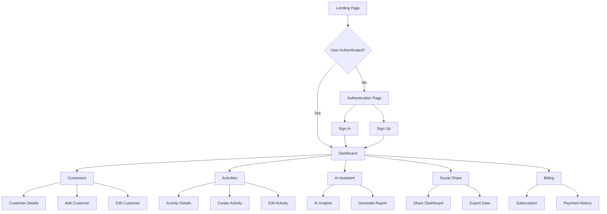

# Site Navigation & Sitemap

## Application Overview
AI Boost Success CRM is a comprehensive customer relationship management system designed for customer success teams. The application provides tools for managing customers, tracking activities, generating AI insights, and team collaboration.

## User Journey Flow



## Complete Sitemap

### 🏠 Public Routes
Routes accessible without authentication

#### `/auth` - Authentication Page
- **Purpose**: User login and registration
- **Components**: 
  - Sign in form
  - Sign up form
  - Password recovery
  - Social authentication options
- **Features**:
  - Email/password authentication
  - Form validation
  - Error handling
  - Redirect after successful auth

#### `/404` - Not Found Page (Catch-all `*`)
- **Purpose**: Handle invalid routes
- **Components**: 
  - Error message
  - Navigation back to app
  - Helpful suggestions

---

### 🔒 Protected Routes
Routes requiring authentication (wrapped in `ProtectedRoute`)

#### `/` - Dashboard (Home)
- **Purpose**: Main application dashboard
- **Components**: 
  - Key metrics overview
  - Recent activities
  - Customer health scores
  - Quick actions
  - Charts and analytics
- **Features**:
  - Real-time data updates
  - Customizable widgets
  - Performance metrics
  - Recent activity feed

#### `/customers` - Customer Management
- **Purpose**: Comprehensive customer management interface
- **Components**: 
  - Customer list/grid view
  - Search and filtering
  - Customer cards
  - Add/edit customer dialogs
- **Features**:
  - Customer profiles
  - Health score tracking
  - Revenue metrics
  - Contact information
  - Custom tags
  - Bulk operations

**Sub-flows:**
- View customer details
- Create new customer
- Edit customer information
- Delete customer
- Assign customer to agent

#### `/activities` - Activity Tracking
- **Purpose**: Task and activity management
- **Components**: 
  - Activity timeline
  - Activity cards
  - Create/edit activity dialogs
  - Calendar integration
- **Features**:
  - Task management (to-do, in-progress, completed)
  - Meeting scheduling
  - Call logging
  - Note taking
  - Priority levels
  - Due date tracking

**Activity Types:**
- 📧 Email communications
- 📞 Phone calls
- 🤝 Meetings
- 📝 Notes
- ✅ Tasks
- 🎯 Milestones

#### `/ai-assistant` - AI Insights & Assistant
- **Purpose**: AI-powered customer insights and recommendations
- **Components**: 
  - AI insight cards
  - Prompt input dialog
  - Generated reports
  - Recommendations panel
- **Features**:
  - Customer analysis
  - Predictive insights
  - Automated recommendations
  - Report generation
  - Custom AI prompts

**AI Capabilities:**
- Customer health predictions
- Churn risk analysis
- Upsell opportunities
- Engagement recommendations
- Automated insights

#### `/social-share` - Collaboration & Sharing
- **Purpose**: Team collaboration and social features
- **Components**: 
  - Share dialogs
  - Export options
  - Team collaboration tools
- **Features**:
  - Dashboard sharing
  - Report exports
  - Team notifications
  - Social media integration

**Sharing Options:**
- Export to PDF
- Share dashboard link
- Email reports
- Social media posts
- Team announcements

#### `/billing` - Subscription & Billing
- **Purpose**: Billing and subscription management
- **Components**: 
  - Subscription status
  - Payment history
  - Billing information
  - Upgrade options
- **Features**:
  - View current plan
  - Payment history
  - Invoice downloads
  - Plan upgrades
  - Usage analytics

---

## Navigation Structure

### Primary Navigation (Sidebar)
1. **🏠 Dashboard** (`/`) - Main overview
2. **👥 Customers** (`/customers`) - Customer management
3. **📋 Activities** (`/activities`) - Task tracking
4. **🤖 AI Assistant** (`/ai-assistant`) - AI insights
5. **📤 Social Share** (`/social-share`) - Sharing tools
6. **💳 Billing** (`/billing`) - Subscription management

### Header Navigation
- **🔍 Search** - Global search functionality
- **🔔 Notifications** - System notifications
- **👤 User Menu** - Profile and settings
  - Profile settings
  - Preferences
  - Sign out

### Breadcrumb Navigation
Dynamic breadcrumbs for deep navigation:
```
Dashboard > Customers > John Doe
Dashboard > Activities > Meeting with Client
```

## User Roles & Permissions

### 👤 Standard User
- Access to all main features
- Can manage assigned customers
- View team activities
- Generate AI insights

### 👑 Administrator
- All standard user permissions
- User management
- System configuration
- Billing management
- Advanced analytics

### 📊 Manager
- Team oversight capabilities
- Advanced reporting
- Performance analytics
- Team member assignments

## Mobile Navigation

### Mobile Menu Structure
- **☰ Hamburger Menu** - Collapsible sidebar
- **🏠 Home** - Quick dashboard access
- **👥 Customers** - Mobile-optimized customer list
- **📋 Activities** - Touch-friendly activity management
- **🤖 AI** - Simplified AI interface
- **👤 Profile** - User settings and logout

### Mobile-Specific Features
- Swipe gestures for navigation
- Pull-to-refresh functionality
- Touch-optimized forms
- Responsive data tables
- Mobile-friendly modals

## Search & Discovery

### Global Search
- **Scope**: Customers, activities, AI insights
- **Features**: 
  - Autocomplete suggestions
  - Recent searches
  - Filtered results
  - Quick actions

### Filtering & Sorting
- **Customer Filters**: Status, health score, revenue, tags
- **Activity Filters**: Type, priority, status, date range
- **AI Insight Filters**: Type, confidence score, date

## Error Handling & Edge Cases

### Error Pages
- **404 Not Found** - Invalid routes
- **403 Forbidden** - Insufficient permissions
- **500 Server Error** - System errors
- **Network Error** - Connectivity issues

### Loading States
- **Page Loading** - Skeleton screens
- **Data Loading** - Spinner components
- **Form Submission** - Button loading states
- **Image Loading** - Placeholder images

## Performance Considerations

### Route Optimization
- **Lazy Loading** - Code splitting by route
- **Prefetching** - Anticipate user navigation
- **Caching** - Route-level caching strategies

### SEO & Meta Tags
- Dynamic page titles
- Meta descriptions
- Open Graph tags
- Structured data

## Accessibility Features

### Navigation Accessibility
- **Keyboard Navigation** - Tab order and focus management
- **Screen Reader Support** - ARIA labels and landmarks
- **High Contrast** - Color accessibility
- **Focus Indicators** - Clear visual focus states

### WCAG Compliance
- Level AA compliance
- Alternative text for images
- Semantic HTML structure
- Keyboard accessibility

This comprehensive sitemap ensures users can efficiently navigate the CRM application while providing clear understanding of the user journey and feature organization.